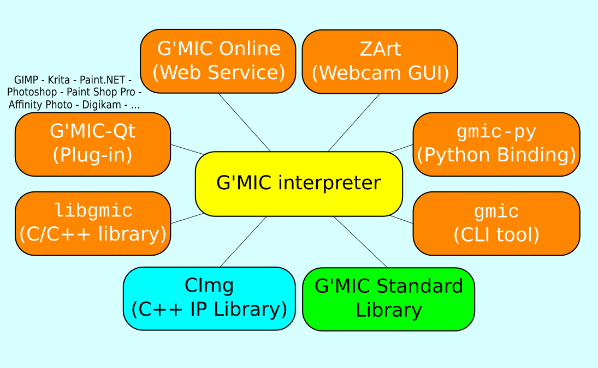
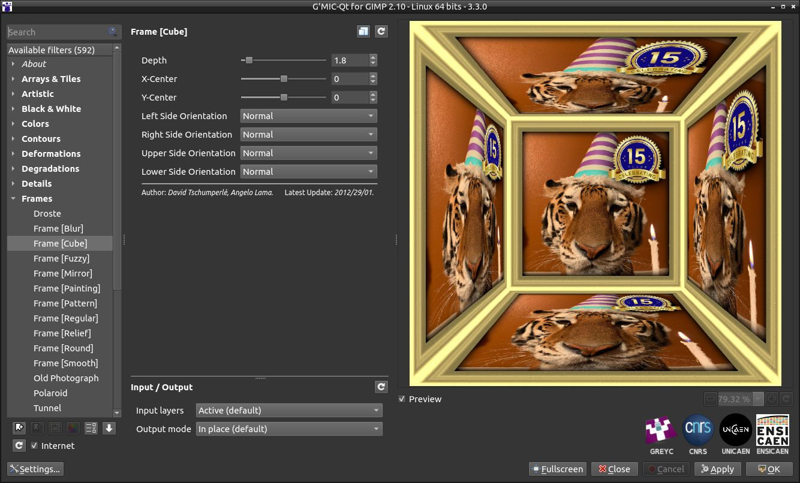
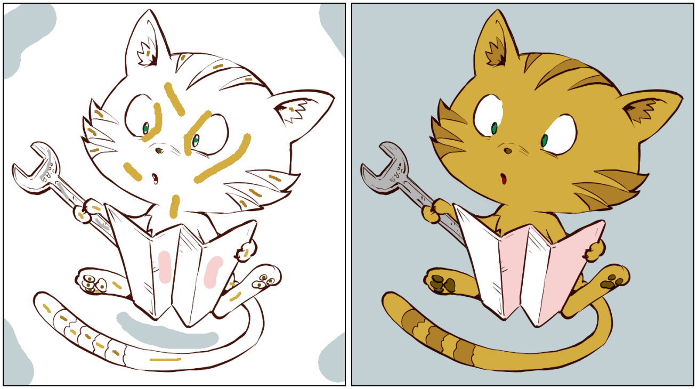
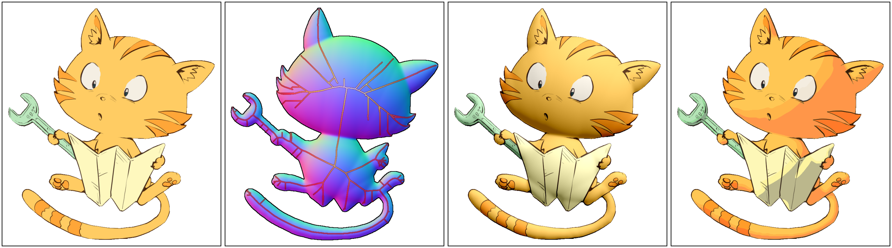

## Abstract

We present `G'MIC`, an open-source self-extending framework that defines an original concise scripting language for writing possibly complex
image processing operators and pipelines.
`G'MIC` provides several user interfaces allowing for the manipulation of digital images, adapted to different levels of user expertise,
either from the command line, or as a C/C`++` library, or as a user-friendly graphical plug-in that extends the capabilities of popular digital
image retouching applications, such as _GIMP_, _Krita_, _Photoshop_, _Affinity Photo_, and others.

## Keywords

Image Analysis and Processing, Scripting Language, User Interfaces.

# Statement of Need

## Context

Intrinsic to `G'MIC`'s design are means to map image processing pipelines to commands, advancing the tool as a self-extending language.
Primal command pipelines may be further assembled into those having wider remits, these suitably named to bespeak their extended purposes
and available for succeeding command prototyping.

`G'MIC` is distributed under the CeCILL license. The core language projects several user interfaces to convert,
process, or visualize *image datasets*. Allied with the pipeline toolset, `G'MIC` embodies a highly flexible image model,
ranging from 1D signals to 3D+t sequences of multi-spectral volumetric images, hence including 2D color images.
This makes it a versatile tool for image processing, with a wide range of applications in research, industrya and graphic design.

## History and Motivation

The `G'MIC` project was initiated in 2008 by research scientists of the IMAGE team at the _GREYC_ laboratory, a public research lab in France.
Their area of research focuses on development of image processing algorithms.

To that end, they first began developing [`CImg`](http://cimg.eu) [@cimg], beginning in 1999 and continuing to the present.
`CImg` is an open-source C`++` library for generic image processing, which means a library that is able to address structurally diverse imagery:
photographs, multi-spectral images, medical images (MRI, X-ray, tomography, etc.), animations, among others.

That said, `CImg` exhibits certain limitations for everyday research work:

1. When one simply wants to apply a predefined `CImg` algorithm to an image, one needs to write a small, C`++` program. It is only a few lines long, but still must be compiled and linked before it can be executed. In the context of research work, such mechanics are distractions. Being able to run those algorithms directly from the command line is tempting.

2. Over time, a large number of these purpose-specific programs have accumulated. They are not broadly useful for integration into `CImg` and have become an unruly "collection" of specialized algorithms. By design, they cannot be easily distributed and are difficult to maintain.

These limitations motivated `G'MIC`'s development in 2008. Two design objectives came to the fore:

1. Enable _pipelines of image processing algorithms_ that may be directly invoked from the command line, without requiring compilation/linking steps.

2. Gather the implementation of specialized algorithms in a single location, facilitating their evolution, maintenance and distribution.

These objectives, in combination with a desire to write new image processing pipelines and algorithms in the most flexible and concise way possible,
gave rise to the idea of _self-extension_. All these objectives led initially to the development of a specialized scripting language,
the `G'MIC` language, and its associated interpreter.

## Related Software

- **Command-line Interfaces:**

The CLI tool `gmic` was originally inspired by _ImageMagick_ [@imagemagick] and _GraphicsMagick_ [@graphicsmagick], particularly the idea of being able to manipulate digital images from a shell.
The main differences between `G'MIC` and _ImageMagick_/_GraphicsMagick_ are that:

1. The type of images processed is more diverse in `G'MIC`.

2. The possibilities offered by the scripting languages associated with each project are more extensive in `G'MIC`. This makes it possible to have conditions, loops, and multi-threaded pipelines, without having to resort to an external scripting tool, such as `sh`.

- **Image Filter Collections:**

There are also related software packages offering predefined filters to be applied to images.
Popular examples are Mathmap [@mathmap], Filter Forge [@filterforge], and Pixelitor [@pixelitor].
While these software packages allow the user to create their own image processing pipeline, their use case is restricted
to the provided graphical user interfaces, with limited scripting possibilities.

# Framework Environment

## Core Components

The current `G'MIC` framework architecture is depicted below.

It revolves around a central component: the **`G'MIC` scripting language interpreter** (yellow),
which uses the native functionalities of the **`CImg` library** (implemented in C`++`, blue),
but relies also on a set of commands, written in the `G'MIC` language themselves, constituting a **_standard library_ (`stdlib`)**
for the framework (green). The other components (orange) stand for the various user interfaces provided by the framework.
More than 1000 distinct commands are currently implemented, covering a large portion of image processing needs.

The interpreter lets the user implement their own scripts, for tasks as varied as writing image filters or generative algorithms,
or creating user interfaces for image manipulation.

## User Interfaces

On top of the interpreter are the user interfaces. Several types of UI are implemented, adapted to varying degrees of user expertise:

- **`gmic`**, a command-line tool to control the `G'MIC` interpreter from a terminal (Fig. 2).

- **_G'MIC-Qt_**, a _Qt_-based [@qt] graphical interface intended to be used as a plug-in for digital image retouching software, such as _GIMP_, _Krita_, _DigiKam_, _Photoshop_, _Affinity Photo_ and others (Fig. 3).

- **`G'MIC` Online**, a website where users can upload color images and apply _G'MIC-Qt_ filters on them.

- **`libgmic`** and **`libcgmic`**, C`++` and C libraries respectively, which basically provide simple C/C`++` APIs to run `G'MIC` pipelines on a set of input images.

- **_ZArt_**, a _Qt_-based interface used mainly for demonstration purposes, which applies `G'MIC` filters on streamed webcam images in real-time.

## Visibility and Community

`G'MIC` has been developed since 2008, at the _GREYC_ laboratory.
The project web page is [https://gmic.eu](https://gmic.eu).
This website brings together a range of resources, from software download links to documentation and tutorial pages.

The core features of the `G'MIC` interpreter are developed by [David Tschumperlé](https://tschumperle.users.greyc.fr/) and
the _G'MIC-Qt_ plug-in by [Sébastien Fourey](https://foureys.users.greyc.fr/), both being permanent researchers at _GREYC_.
The other contributors (for documentation, creation of new filters, or implementation of other user interfaces) can be found on
the [software's forum](https://discuss.pixls.us/c/software/gmic/10), hosted by _Pixls.Us_,
an association that promotes the use of open-source software dedicated to photography and image creation.

The `G'MIC` source code is available on these various GitHub repositories:
[`gmic`](https://github.com/GreycLab/gmic/) (interpreter), [`gmic-qt`](https://github.com/GreycLab/gmic-qt/) (plug-in) and
[`gmic-community`](https://github.com/GreycLab/gmic-community/) (external contributions, documentation).

# Examples of Research Work Conducted With `G'MIC`

To demonstrate the utility of `G'MIC` for research, we provide several examples of image processing tasks conducted
using `G'MIC` for algorithm development and prototyping. For each example, we reference its associated research publication.

- **Patch-Based Image Inpainting**:

`G'MIC` has been used to design and implement an original patch-based image _inpainting_ algorithm in [@buyssens2015exemplar] (Fig. 4).

- **Color LUT Compression**:

We used `G'MIC` to handle the problem of 3D _CLUTs_ compression, for the efficient storage of generic color transformations [@tschumperle2020reconstruction].
More than 1100 _CLUTs_ are thus provided in `G'MIC`, requiring only 4 MB of data storage (Fig. 5).

- **Semi-automatic Colorization of Line Arts**:

Colorizing line art drawings is a problem that illustrators are familiar with, as traditional digital tools (e.g., _Bucket Fill_)
do not always work well, e.g., when lines are anti-aliased or contain gaps in the drawing.
In [@fourey2018fast], we describe a _"Smart coloring"_ algorithm, implemented in `G'MIC`, that analyzes the geometry of the contours
and automatically deduces a reasonable flat-colored layer from a user-defined set of colored strokes (Fig. 6).

Note that this colorization algorithm has been subsequently implemented natively in _GIMP_ [@jehan18].

- **Automatic Illumination of Flat-colored Drawings**:

In a similar vein, we have designed an algorithm to automatically illuminate flat-colorized drawings
by generating a light/shadow layer above a flat-colored layer [@tschumperle2022automatic] (Fig. 7).

- **Patch-Based Image Style Transfer**:

Image stylization consists of transforming an input image to give it a pictorial style close to that of a second image (style image).
In 2022, we successfully developed a patch-based multi-scale algorithm with low algorithmic cost [@samuth2022patch],
which is now a part of `G'MIC` (Fig. 8).

- **Debanding of Astronomical Images**:

`G'MIC` is used in the astronomy research community, in particular for processing images from the James Webb Space Telescope,
which exhibits band frequency noise (efficiently mitigated with `G'MIC` filter **Banding Denoise**).
`G'MIC` has been cited in [@ray2023outflows], where images from protostar _HH211_ were processed.
One of those made the cover of _Nature_ of October 2023 (Fig. 9).

# Acknowledgments

We would like to express our deepest gratitude to the developers, contributors and donors, both regular and one-off, all over the world. We are very grateful to the “CNRS Sciences Informatiques” institute, which helped accelerate G'MIC's growth by funding a development engineer for two consecutive years, and to the heads of the GREYC laboratory, who have supported this project from the outset. We would also like to thank our amazing community of users, who regularly provide us with beautiful/fun/innovative creations in which G'MIC filters have been used.

# In Memoriam

This article is dedicated to Sébastien Fourey, co-developer of the G'MIC project, who passed away in October 2024.
He was the kindest, most caring person you’ll ever meet, as well as being extremely competent and passionate
about computing, algorithms, and software development as a whole. He always believed in the magic of free software.
The world has lost a talented developer, a great researcher and teacher, but above all a person of great humanity.
Rest in peace, Sébastien.

# References
