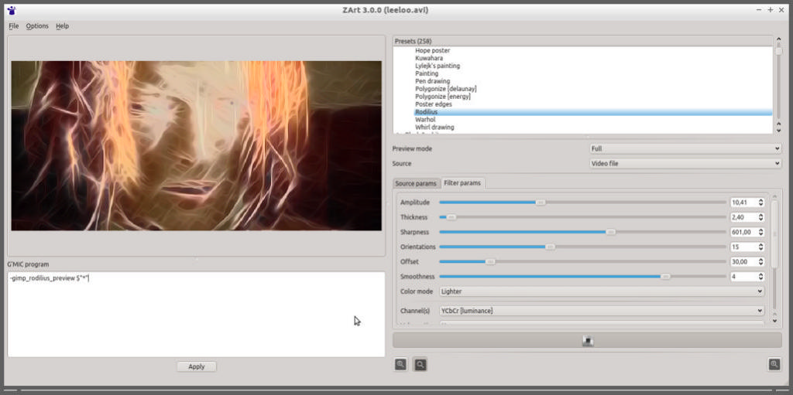
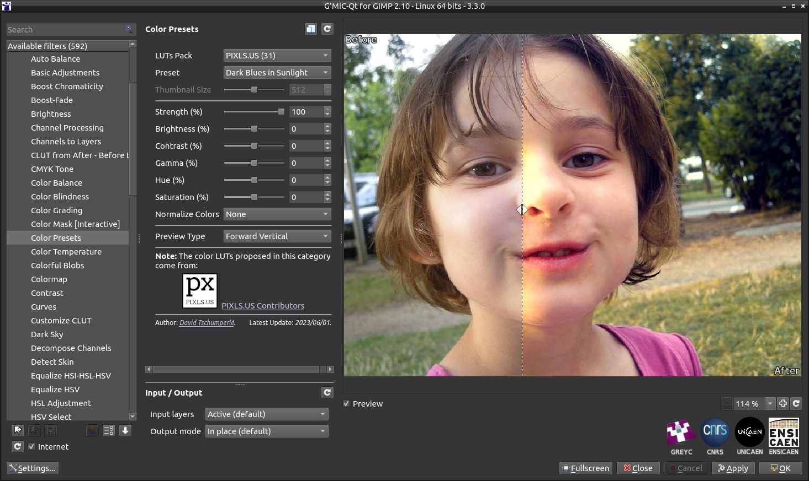
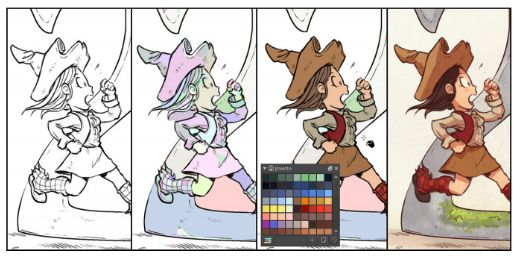
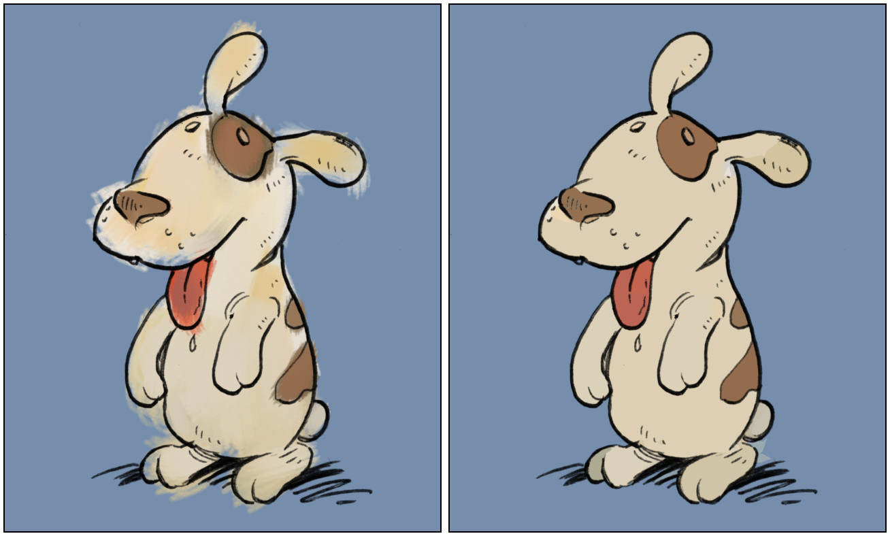
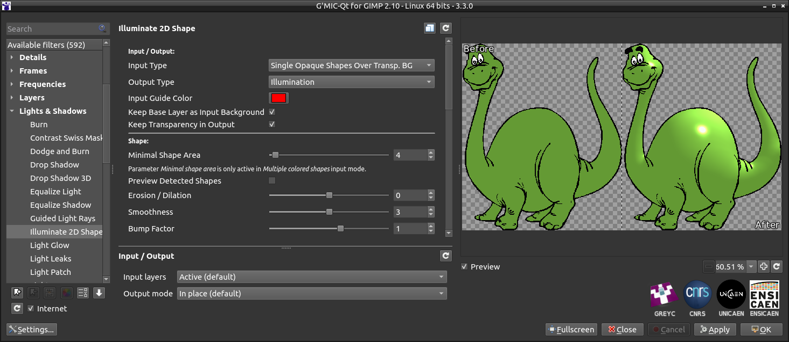

## Abstract

<<<<<<< HEAD
We present `G'MIC`, an open-source self-extending framework that defines an original, concise, scripting language for the writing of possibly complex
image processing operators and pipelines.
`G'MIC` also provides several user interfaces allowing for the manipulation of digital images, adapted to different levels of user expertise,
=======
We present `G'MIC`, an open-source self-extending framework that defines an original, concise, scripting language for writing possibly complex
image processing operators and pipelines.
`G'MIC` provides several user interfaces allowing for the manipulation of digital images, adapted to different levels of user expertise,
>>>>>>> bd4aac57bdad4a5e237d2655d81736575a4c9b2b
either from the command line, or as a _C/C`++`_ library, or as a user-friendly graphical plug-in that extends the capabilities of popular digital
image retouching applications, such as _GIMP_, _Krita_, _Photoshop_, _Affinity Photo_ and others.

## Keywords

<<<<<<< HEAD
Image Analysis, Processing and Filtering, Computer Graphics, Scripting Language, User Interfaces, Creative Coding.

# 1. Introduction

## 1.1. Context

Tools not only shape work but set limits as to how far such work can go. Tools with limited capabilities or rigid behaviors not only circumscribe results but also constrain tool-users' awareness of what is possibile — they suppose from such inflexible tools only notions of what cannot be done.

Intrinsic to `G'MIC`'s design are means to map pipelines to commands, advancing the tool as a self-extending language and fortifying how users' conduct their work. Primal command pipelines may be further assembled into those having wider remits, these suitably named to bespeak their extended purposes and available for succeeding command prototyping.

`G'MIC` itself is based upon primitives of the _C`++`_ library [`CImg`](http://cimg.eu) [@cimg] that are broadly applicable to image processing work and which have been optimized for CPU performance. Most commands in the standard `G'MIC` distribution extend these primitives, using the aforementioned scheme. It is one which remains available to users, extending the language in line with their specific domains of expertise and making the language "their own".

`G'MIC` is distributed under the CeCILL free software licenses (GPL-compatible). The core language projects several user interfaces to convert, process or visualize generic *image datasets*. Allied with pipeline toolset, `G'MIC` embodies a highly flexible image model, ranging from 1D scalar signals to 3D+t sequences of multi-spectral volumetric images, hence including 2D color images.
This makes it a versatile tool for image processing, with a wide range of applications in research, industry and graphic design.

## 1.2. History and Motivation

The `G'MIC` project was started in mid-2008 by [David Tschumperlé](https://tschumperle.users.greyc.fr), a research scientist working in the IMAGE team of the _GREYC_, a public research laboratory affiliated with the CNRS institute in France.
David's area of research is the study and elaboration of image processing algorithms.

To that end, he first began developing [`CImg`](http://cimg.eu) [@cimg], beginning in 1999 and continuing to the present. `CImg` is  an open-source _C`++`_ library for generic image processing. Here, _generic_ implies a library that addresses structurally diverse imagery: photographs, multi-spectral images (e.g. from satellites), medical images (MRI, X-ray, tomography, etc.) and technical animations, among others.
The `CImg` library has therefore been designed to handle a wide variety of different image types, whether defined on 2D or 3D grids, or with any number of channels.
He still develops and maintains this library.

That said, `CImg` exhibits certain limitations for everyday research work:

1. When one simply wants to apply a predefined algorithm from `CImg` to an image, one needs to write a small, _C`++`_ program. Perhaps it is only a few lines long, but still it must be compiled and linked — and possibly debugged — before it can be executed. In the context of research work, such mechanics are just so many distractions. The idea of being able to run those algorithms directly from the command line is tempting.

2. Over time, a large number of these small, but purpose-specific, programs has accumulated. They solve specific problems but rarely see follow-on use. They are not broadly useful for integration into the `CImg` library and have become an unruly "collection" of specialized algorithms. By design, they cannot be easily distributed and are difficult to maintain (as opposed to a language having package managers, like Python).

These limitations motivated `G'MIC`'s development, beginning in 2008. Two design objectives came to the fore:

1. Enable _pipelines of image processing algorithms_ that may be directly invoked from the command line, without requiring compilation or linking steps.

2. Gather the implementation of specialized algorithms in a single location, facilitating their evolution, maintenance and distribution.

These objectives, in combination with a desire to write new image processing pipelines and algorithms in the most flexible and concise way possible, gave rise to the idea of _self-extension_.

It is well-known that research scientists are loathe to type; there are far more useful investments of time. In that light, there emerged a scheme to equate concise, shorthand words for pipelines — indeed, to _define_ new commands with pipelines. It is straightforward to see the advancement of this scheme, for such new commands can further define yet other commands. Such a mechanism also aligns well with a _write once, run everywhere_ doctrine. Improvements to a pipeline underlying a command propagates out to wherever that command is employed.

All these objectives led initially to the development of a specialized scripting language: the `G'MIC` language, and its associated interpreter, distributed as free software.

The first user interface created was `gmic`, the command line interface (_CLI_) tool that permits the execution of image processing code written in the `G'MIC` language directly from a shell. Other interfaces have followed since then, and will be detailed in Section 2.

## 1.4. Related Software

- **Command-line Interfaces:**

The command line interface `gmic` has been originally inspired by [_ImageMagick_](https://imagemagick.org/index.php) [@imagemagick] and [_GraphicsMagick_](http://www.graphicsmagick.org/) [@graphicsmagick], particularly the idea of being able to manipulate digital images from a shell. What all these projects have
in common is that they define distinct command languages, enabling the creation of image processing pipelines of varying complexity.

The main differences between `G'MIC` and _ImageMagick_/_GraphicsMagick_ are as follows:

1. The type of images processed is more diverse in `G'MIC`. Although _ImageMagick_ and _GraphicsMagick_ are capable to a certain extent of loading volumetric or hyperspectral images, the possibilities for processing these generic images is limited to the use of certain filters only
(on the other hand, _ImageMagick_ and _GraphicsMagick_ offer far more possibilities for converting image file formats, with format-specific encoding options).

2. The possibilities offered by the scripting languages associated with each project, for writing image processing pipelines, are more extensive in `G'MIC`. In particular, `G'MIC`'s scripting language makes it possible to write conditions, loops and multi-threaded pipelines, without having to resort to an external scripting language (such as `sh` or `bash`, which are typically used in conjunction with _ImageMagick_/_GraphicsMagick_). The richness of the `G'MIC` built-in scripting language (detailed in Section 3) ensures maximum portability of the developed pipelines between different architectures (_Linux_/_Windows_/_BSD_).

- **Image Filter Collections:**

There are also related software packages offering predefined filter sets to be applied to images. Popular examples are Mathmap [@mathmap], Filter Forge [@filterforge] and Pixelitor [@pixelitor].
While these software somehow allows the user to create its own pipeline of image processing filters, their use case is restricted to the provided graphical user interfaces, with quite limited scripting possibilities.

# 2. Framework Environment

## 2.1. Core Components

The current architecture of the `G'MIC` framework is depicted on Fig. 1. This corresponds to the current state of the framework (version **3.3.2**), at the time of writing.


The organization of this framework revolves around a central component: the **`G'MIC` scripting language interpreter** (in yellow). This interpreter uses the native functionalities of the **`CImg` library** (which is implemented in _C`++`_, in blue), but relies also on a set of commands, written in the `G'MIC` language themselves, constituting a **_standard library_ (`stdlib`)** for the framework (in green). The other components (in orange) stand for the different user interfaces provided by the framework.

More than 1000 distinct commands are currently implemented in the `stdlib`, covering a large portion of general image processing needs.
These commands are gathered by categories, and documented on the [reference pages](https://gmic.eu/reference/list_of_commands.html) of the project. The table below lists these categories, sorted by the respective number of commands they contain, and gives examples of typical commands found in each category:

| **Category**   | **# of commands** | **Examples of key commands** |
|:---|:---:|:---|
| Colors | 107 | `rgb2hsv`, `rgb2lab`, `retinex`, `sepia` |
| Filtering | 105 | `convolve`, `dilate`, `fft`, `sharpen` |
| Convenience Functions | 105 | `files`, `img2base64`, `strcapitalize` |
| 3D Meshes | 95 | `isosurface3d`, `rotate3d`, `torus3d` |
| Input / Output | 89 | `camera`, `echo`, `input`, `output`, `display` |
| Mathematical Operators | 58 | `add`, `argmax`, `cos`, `mul`, `sqrt` |
| Geometry Manipulation | 55 | `crop`, `resize`, `rotate`, `split` |
| Neural Networks | 56 | `nn_load`, `nn_conv2d`, `nn_maxpool2d` |
| Value Manipulation | 54 | `cut`, `equalize`, `normalize`, `map` |
| Interactive Commands | 47 | `demos`, `x_pacman`, `x_warp` |
| Features Extraction | 46 | `betti`, `histogram`, `label`, `skeleton` |
| Image Drawing | 41 | `ellipse`, `graph`, `line`, `polygon`, `text` |
| Artistic | 39 | `cartoon`, `cubism`, `polaroid`, `stencil` |
| Flow Control | 31 | `do`, `error`, `for`, `if`, `return`, `while` |
| Arrays, Tiles and Frames | 28 | `array`, `frame_xy`, `frame_blur` |
| Warpings | 24 | `deform`, `fisheye`, `twirl`, `warp` |
| Image Sequences and Videos | 20 | `animate`, `morph`, `apply_video` |
| Degradations | 13 | `cracks`, `pixelize`, `vignette` |
| Blending and Fading | 12 | `blend`, `fade_linear`, `fade_radial` |
| Matrix Computation | 11 | `dijkstra`, `eigen`, `invert`, `svd` |
| List Manipulation | 10 | `move`, `name`, `remove`, `reverse` |
| Other Commands | 3 | `debug`, `help`, `version` |

The `G'MIC` interpreter lets the user write and run custom programs using this predefined set of commands, for tasks as varied as writing new image filters, implementing generative algorithms or creating user interfaces for image manipulation.

## 2.2. User Interfaces

On top of the `G'MIC` interpreter are the user interfaces. Several types of user interface are implemented in the `G'MIC` framework, adapted to varying degrees of user's expertise.
Those interfaces are :

- **`gmic`**, a _command-line_ tool used to control the `G'MIC` interpreter from a terminal. It is actually one of the most powerful interface of the project, as it is able to manage all kind of image types (1D, 2D, 3D, multi-spectral, etc.). It can also open display windows for having basic user interaction when needed, typically for displaying images. Fig. 2 shows an example of use of `gmic` from a console, where a color image is imported, resized, blurred, converted to a 3D elevation mesh, and finally displayed in an interactive window.


- **_G'MIC-Qt_** is a _Qt_-based [@qt] graphical interface intended to be used as a _plug-in_ for digital image retouching software, such as _GIMP_, _Krita_, _DigiKam_, _Photoshop_, _Affinity Photo_ and others, or as a _stand-alone_ program. This interface focuses on 2D color image processing. It proposes a set of filters (over 590 to date) to be applied to the user's input images. It features a fairly advanced system of dynamic user interface generation, based on the syntactic analysis of comment lines defined in `G'MIC` command files (thus including the image filters defined in the `stdlib`). All proposed filters are therefore written in the `G'MIC` language, with their parameter setting interface dynamically generated by the plug-in. It also features a filter update function, allowing to add/remove or correct existing filters without having to re-install new binaries of the software. Fig. 3 shows the _G'MIC-Qt_ interface applying an effect to a color image, here run from _GIMP_. Users of the plug-in are able to write their own `G'MIC` command files, in order to add new custom filters (with the corresponding _GUI_) into the plug-in.


- **`G'MIC` Online** is a website where a user can upload a color image and apply one of the _G'MIC-Qt_ filters on it (Fig.4).
It is a simple way to test the `G'MIC` filters and effects without having to install anything locally on the user's computer. It is written in CSS/Javascript and relies on the `gmic` _CLI_ tool on the server side to render the image filters.


- **`libgmic`** and **`libgmic`** are respectively _C`++`_ and _C_ libraries which allow the access to the `G'MIC` features directly from a _C/C`++`_ source code. They basically provide a simple _C/C`++`_ _API_ to run a `G'MIC` pipeline on a set of input images passed to the library.

- **_ZArt_** is a _Qt_-based graphical interface used mainly for demonstration purposes (Fig. 5), which applies `G'MIC` filters and effects on streamed webcam images in (almost) real-time.



- [**`gmic-py`**](https://pypi.org/project/gmic/) is a project for getting a _Python_ binding for `G'MIC` (still work-in-progress).
Its aim is to provide Python programmers with the full range of filters and image processing functions included in the `G'MIC` framework.

## 2.3. Visibility and Community

The `G'MIC` framework has been developed since 2008, mainly in the [IMAGE team](https://www.greyc.fr/equipes/image/) at the
[_GREYC_ laboratory](https://www.greyc.fr/), a French public research laboratory specialized in computer sciences.
=======
Image Analysis and Processing, Scripting Language, User Interfaces.

# Statement of Need

## Context

Intrinsic to `G'MIC`'s design are means to map image processing pipelines to commands, advancing the tool as a self-extending language.
Primal command pipelines may be further assembled into those having wider remits, these suitably named to bespeak their extended purposes
and available for succeeding command prototyping.

`G'MIC` is distributed under the CeCILL licenses. The core language projects several user interfaces to convert,
process or visualize *image datasets*. Allied with pipeline toolset, `G'MIC` embodies a highly flexible image model,
ranging from 1D signals to 3D+t sequences of multi-spectral volumetric images, hence including 2D color images.
This makes it a versatile tool for image processing, with a wide range of applications in research, industry and graphic design.

## History and Motivation

The `G'MIC` project was initiated in 2008 by research scientists of the IMAGE team at the _GREYC_ laboratory, a public research lab in France.
Their area of research focuses on development of image processing algorithms.

To that end, they first began developing [`CImg`](http://cimg.eu) [@cimg], beginning in 1999 and continuing to the present.
`CImg` is an open-source _C`++`_ library for generic image processing, which means a library that is able to address structurally diverse imagery:
photographs, multi-spectral images, medical images (MRI, X-ray, tomography, etc.) and animations, among others.

That said, `CImg` exhibits certain limitations for everyday research work:

1. When one simply wants to apply a predefined `CImg` algorithm to an image, one needs to write a small, _C`++`_ program. It is only a few lines long, but still must be compiled and linked before it can be executed. In the context of research work, such mechanics are so many distractions. Being able to run those algorithms directly from the command line is tempting.

2. Over time, a large number of these purpose-specific programs has accumulated. They are not broadly useful for integration into `CImg` and have become an unruly "collection" of specialized algorithms. By design, they cannot be easily distributed and are difficult to maintain.

These limitations motivated `G'MIC`'s development, in 2008. Two design objectives came to the fore:

1. Enable _pipelines of image processing algorithms_ that may be directly invoked from the command line, without requiring compilation/linking steps.

2. Gather the implementation of specialized algorithms in a single location, facilitating their evolution, maintenance and distribution.

These objectives, in combination with a desire to write new image processing pipelines and algorithms in the most flexible and concise way possible,
gave rise to the idea of _self-extension_. All these objectives led initially to the development of a specialized scripting language:
the `G'MIC` language, and its associated interpreter.

## Related Software

- **Command-line Interfaces:**

The CLI tool `gmic` has been originally inspired by _ImageMagick_ [@imagemagick] and _GraphicsMagick_ [@graphicsmagick], particularly the idea of being able to manipulate digital images from a shell.
The main differences between `G'MIC` and _ImageMagick_/_GraphicsMagick_ are that :

1. The type of images processed is more diverse in `G'MIC`.

2. The possibilities offered by the scripting languages associated with each project are more extensive in `G'MIC`. It makes possible to have conditions, loops and multi-threaded pipelines, without having to resort to an external scripting tool, such as `sh`.

- **Image Filter Collections:**

There are also related software packages offering predefined filters to be applied to images.
Popular examples are Mathmap [@mathmap], Filter Forge [@filterforge] and Pixelitor [@pixelitor].
While these software somehow allows the user to create its own image processing pipeline, their use case is restricted
to the provided graphical user interfaces, with limited scripting possibilities.

# Framework Environment

## Core Components

The current `G'MIC` framework architecture is depicted below.


It revolves around a central component: the **`G'MIC` scripting language interpreter** (yellow),
which uses the native functionalities of the **`CImg` library** (implemented in _C`++`_, blue),
but relies also on a set of commands, written in the `G'MIC` language themselves, constituting a **_standard library_ (`stdlib`)**
for the framework (green). The other components (orange) stand for the various user interfaces provided by the framework.
More than 1000 distinct commands are currently implemented, covering a large portion of image processing needs.

The interpreter lets the user implements their own scripts, for tasks as varied as writing image filters or generative algorithms,
or creating user interfaces for image manipulation.

## User Interfaces

On top of the interpreter are the user interfaces. Several types of UI are implemented, adapted to varying degrees of user's expertise:

- **`gmic`**, a _command-line_ tool to control the `G'MIC` interpreter from a terminal (Fig. 2).

- **_G'MIC-Qt_**, a _Qt_-based [@qt] graphical interface intended to be used as a _plug-in_ for digital image retouching software, such as _GIMP_, _Krita_, _DigiKam_, _Photoshop_, _Affinity Photo_ and others (Fig. 3).

- **`G'MIC` Online**, a website where users can upload color images and apply _G'MIC-Qt_ filters on them.

- **`libgmic`** and **`libcgmic`**, respectively _C`++`_ and _C_ libraries which basically provide simple _C/C`++`_ _APIs_ to run `G'MIC` pipelines on a set of input images.

- **_ZArt_**, a _Qt_-based interface used mainly for demonstration purposes, which applies `G'MIC` filters on streamed webcam images in real-time.


## Visibility and Community

`G'MIC` has been developed since 2008, at the _GREYC_ laboratory.
>>>>>>> bd4aac57bdad4a5e237d2655d81736575a4c9b2b
The project web page is [https://gmic.eu](https://gmic.eu).
This website brings together a range of resources, from software download links to documentation and tutorial pages.

The core features of the `G'MIC` interpreter are developed by [David Tschumperlé](https://tschumperle.users.greyc.fr/),
the _G'MIC-Qt_ plug-in by [Sébastien Fourey](https://foureys.users.greyc.fr/), both being permanent researchers at _GREYC_.
The other contributors (for documentation, creation of new filters, or implementation of other user interfaces) can be found on
<<<<<<< HEAD
the [software's forum pages](https://discuss.pixls.us/c/software/gmic/10), hosted by [Pixls.Us](https://pixls.us/),
an association whose goal is to promote the use of open-source software dedicated to photography and image creation.
This forum is the place to go to get answers to questions about the software and chat with developers and users.
=======
the [software's forum](https://discuss.pixls.us/c/software/gmic/10), hosted by _Pixls.Us_,
an association which promotes the use of open-source software dedicated to photography and image creation.
>>>>>>> bd4aac57bdad4a5e237d2655d81736575a4c9b2b

The `G'MIC` source code is available on these various github repositories:
[`gmic`](https://github.com/GreycLab/gmic/) (interpreter), [`gmic-qt`](https://github.com/c-koi/gmic-qt/) (plug-in) and
[`gmic-community`](https://github.com/GreycLab/gmic-community/) (external contributions, documentation).

<<<<<<< HEAD
Last but not least, the project provides regular updates on new developments on social networks such as
[Mastodon](https://piaille.fr/@gmic) and [Twitter](https://twitter.com/gmic_eu).

## 3. The `G'MIC` Scripting Language

Here we provide some insights about the `G'MIC` scripting language and illustrate its use in the creation of custom image processing algorithms and pipelines.

## 3.1. Overview and Main Features

The `G'MIC` language has been specifically designed for manipulating digital images, in the broadest sense of the term.
This means, making it easy to apply image processing algorithms that have already been written (e.g. those from the `stdlib`), but also developing new algorithms, either in the form of elaborated pipelines, or in the form of "low-level" operations applied directly to the image pixels.
This represents a wide variety of different use cases, so some key features of the `G'MIC` language are as follows:

- The ability to handle generic image data type: up to sequences of 4D (3D + channels) hyperspectral images with floating-point valued pixels/voxels.
- An already implemented large collection of various image processing operators.
- A powerful math evaluator which supports operations on scalars, complexes, vectors and strings.
- Multi-threaded computations when possible, using OpenMP [@openmp].
- Drawing of primitives and 3D rendering capabilities.
- The ability to manage display windows and handle user events, which leads to the possible creation of simple graphical user interfaces.
- A network-based update mechanism for the filters and commands.

## 3.2. Language Rules

`G'MIC` is both a _procedural_ and an _interpreted_ language, and therefore shares common properties with equivalent scripting languages
such as _bash_, _Python_, _LUA_ or _Javascript_, particularly with regard to program structuring and the use of flow control instructions.
It does, however, have its own distinctive features, some of which we list below:

- **Image storage:**
At any time, `G'MIC` manages one list of numbered (and optionally named) pixel-based images, entirely stored in computer memory.
The first image of the list has index `0` and is denoted by `[0]`. The second image of the list is denoted by `[1]`, the third by `[2]` and so on.
Negative indices are treated in a periodic way: `[-1]` refers to the last image of the list, `[-2]` to the penultimate one, etc.
A named image may be also indicated by `[name]`.
Then, `G'MIC` defines a set of various commands to manage this list of images, in a very flexible way: You can insert or remove images in the list, rearrange image order, process images (individually or grouped),
merge image data together, display and output image files, etc.

- **Types of images:**
Each image is modeled as a 1D, 2D, 3D or 4D array of scalar values, uniformly discretized on a rectangular/parallelepipedic domain.
The four dimensions of this array are respectively denoted by `width` (number of columns), `height` (number of rows), `depth` (number of slices)
and `spectrum` (number of channels).
There are no hard limitations on the size of the image along each dimension, within the limits of the available memory.
`G'MIC` makes it also possible to manage 3D meshes. A 3D mesh is stored as `1xN` image containing the vertex coordinates, primitive definition,
as well as their associated colors/textures, all these information being merged and unrolled as a single data vector.

- **Definition of a processing pipeline:**
In `G'MIC`, a processing pipeline is described as a sequence of items (separated by the _space_ character) which are interpreted and
executed from the left to the right. For instance, the expression:
```
filename.jpg blur 3,0 sharpen 10 resize 200%,200% output file_out.jpg
```
defines a valid pipeline composed of nine `G'MIC` items.
Each `G'MIC` item is a string that is either a _command_, a _list of command arguments_, a _filename_ or a _special input string_.

- **Command selections:**
A command may be applied only to a subset of the image list, by appending `[selection]` to the command name. For instance,
    - `command[-2]`: Apply command only on the penultimate image `[-2]` of the list.
    - `command[3-6]`: Apply command only on images `[3]`, `[4]`, `[5]` and `[6]`.
    - `command[0--1:2]`: Apply command only on images of the list with even indices.
    - `command[name1,name2]`: Apply command on named images `name1` and `name2`.

- **Substituting expressions:**
In `G'MIC`, items containing braces `{}` or dollars `$` may be substituted before being evaluated.
These substituting expressions are used for on-the-fly evaluation of math expressions (e.g. `{3+cos(0)}` is substituted by `4`),
or to get interpreter or environment variables (e.g. `$HOME` is substituted by `/home/username`).

## 3.3. Examples of Pipeline and Algorithm Implementations

The set of rules defining the language is fairly small, but provides a complete, high-performance scripting language for image processing.
Rather than go into the syntactical details of the language, we illustrate it below with a few examples of pipeline constructions,
for a variety of image processing tasks.

### 3.3.1. Difference of Gaussians

Given a 2D multi-spectral image $I:\mathbb{R}^2\rightarrow\mathbb{R}^n$,
the [difference of Gaussians](https://en.wikipedia.org/wiki/Difference_of_Gaussians) (*DoG*) of the image $I$
is the image $\Gamma_{\sigma_1,\sigma_2}:\mathbb{R}^2\rightarrow\mathbb{R}^n$
obtained by subtracting the image $I$ convolved with the Gaussian of standard deviation $\sigma_2$ from the image $I$
convolved with a Gaussian of standard deviation $\sigma_1$, _i.e._ $\Gamma_{\sigma_1,\sigma_2} = I*G_{\sigma_1}-I*G_{\sigma_2},$
where $G_{\sigma} : \mathbb{R}^2\rightarrow\mathbb{R}$ is a 2D Gaussian kernel with standard deviation $\sigma$:

$G_{\sigma}(x,y) = \frac{1}{(\sigma^2 2\pi)} e^{-\frac{\|x\|^2+\|y\|^2}{2\sigma^2}}$

Using the `G'MIC` language, such a filter can be written as a new function `dog` (e.g. in a file `dog.gmic`) as:
```
# dog : _sigma1>=0,_sigma2>=0
# Apply DoG filter on selected images.
# Default values: 'sigma1=1' and 'sigma2=2'.
dog : check "${1=1}>=0 && ${2=2}>=0" # Check validity of arguments
  foreach {      # Loop over each image in the command selection
    +blur[0] $2  # Get blurred version of the image
    blur[0] $1   # Blur initial image in-place
    sub          # Subtract the two images together
  }
```

And then used afterwards, e.g. in a command line call, here on two input images:
```
$ gmic dog.gmic flower.jpg butterfly.jpg +dog 1,1.6
```
resulting in this list of images (Fig. 6):


In the source code of the `dog` function, it's interesting to note that:

- Values of arguments are accessible using the `$1`, `$2`, ... syntax.

- The `foreach { ... }` constructs ensures that the filter can be applied to several input images at once (specified in the command selection),
as it was done in our example.

- The use of the `+` prefix (e.g. in `+blur` and `+dog`) forces a command to return its result as new images inserted
at the end of the image list, rather than processing the image in-place.

### 3.3.2. Artistic Effect

Here, we show how to mimic the [Fractalius effect](https://www.redfieldplugins.com/filterFractalius.htm), a popular, closed-source, image filter, developed by _RedField_.
As stated in their webpage, it "creates unusual, eccentric artworks in a single step. The effects are based on extraction of so-called hidden fractal texture of an image. You can also simulate various types of exotic lightings and high realistic pencil sketches" [@ashbrook2009fractalius].
A similar effect (although not exactly the same) can be actually done by several steps of linear image blurs along different orientations,
that are sharpened and merged together with a _Lighten_ blending mode (i.e. pointwise maximum of pixel values).
The corresponding `G'MIC` script is implemented as follows:
```
# Arguments: 0<=_amplitude<=100,_0<=thickness<=100,_sharpness>=0, \
# _nb_orientations>0,_offset,_color_mode={ 0=darker | 1=brighter }.
fractalius : check "${1=10}>=0 && $1<=200 && ${2=10}>=0 && $2<=100 && "\
                   "${3=400}>=0 && ${4=7}>0 && isbool(${6=1})" skip ${5=0}
  foreach {
    if !$6 negate fi
    +fill 0
    repeat round($4) {
      angle:=$5+$>*180/round($4)
      +blur_linear[0] $1%,{$1*$2/100}%,$angle,1
      blur[-1] 0.7 sharpen[-1] $3
      max[1,-1]
    }
    keep[1]
    if !$6 negate fi
  }
```

This filter has been already a part of the `G'MIC` framework since 2011, starting from an idea of [Rod](http://gimpchat.com/memberlist.php?mode=viewprofile&u=196), a user from the [GimpChat](http://gimpchat.com/) forums (Fig. 7).
This example shows that `G'MIC` is well suited to prototype potentially complex image processing filters with a few lines of script only,
particularly thanks to its embedded mathematical evaluator and its very concise syntax.


### 3.3.3. NL-Means

The [Non-local means](https://en.wikipedia.org/wiki/Non-local_means) algorithm (NL-means, [@buades2005non]) is a classical noise reduction
technique used in image processing.
It works by averaging the pixel values in an image, giving more weight to pixels whose neighborhoods are similar to the neighborhood of the target pixel
in a non-local sense.
In other words, it considers not only nearby pixels but also those from different parts of the image that exhibit similar patterns.
This approach helps preserving image details while effectively reducing noise, making it a powerful tool for image denoising.

Basically, a NL-means filtered image $J:\mathbb{R}^2\rightarrow\mathbb{R}^n$ is computed from an input image $I:\mathbb{R}^2\rightarrow\mathbb{R}^n$, as
$J(x,y) = {1 \over N(p)}\sum_{p,q \in \Omega}w(p,q)I(p,q)$
where $I(p,q)$ is the unfiltered value of the image at point $(p,q)$.
The normalization factor $N$ is given by:
$N = \sum_{p,q \in \Omega}w(p,q)$.
The weights $w(p,q)$ are Gaussian functions, defined as:
$w(p,q) = e^{-{{\left \|\| P(q)^2-P(p)^2\right \|\|}\over \sigma^2}}$,
where $P(p)$ and $P(q)$ are the values of the patches (unrolled as vectors) centered respectively at points $p$ and $q$.


Non-local means can be implemented quite easily in `G'MIC` language, thanks to its embedded math evaluator, along with command `fill` that computes
a custom math expression per pixel:

```
#@cli nlmeans : _patch_size>0,_lookup_size>0,sigma>=0
#@cli : Apply NL-means filter on selected images.
#@cli : Default values: 'patch_size=5', 'lookup_size=3' and 'sigma=100'.
nlmeans : check "isint(${1=5}) && $1>0 && isint(${2=8}) && $2>0 && ${3=100}>=0"
  fill "
    const patch_size = $1;
    const patch_beg = int($1/2);
    const lookup_size = $2;
    const lookup_beg = int($2/2);
    const sigma = $3;

    V_ref = crop(x - patch_beg,y - patch_beg,0,c,patch_size,patch_size,1,1);
    sum_weights = new_value = 0;

    repeat (lookup_size,q,
      Y = y - q + lookup_beg;
      repeat (lookup_size,p,
        X = x - p + lookup_beg;
        V = crop(X - patch_beg,Y - patch_beg,0,c,patch_size,patch_size,1,1);
        V-=V_ref;
        weight = gauss(norm(V),sigma,0);
        new_value+=weight*i(X,Y);
        sum_weights+=weight;
      );
    );
    new_value/=sum_weights"
```

The command above is composed of a single `fill` command that is actually a large math expression, evaluated for each pixel
by the `G'MIC` math parser (and in this case, automatically parallelized, as the expression is indeed independent for each pixel).
As before, this command can be called from the command line to denoise one or several images (Fig.8), with:
```
$ gmic nlmeans.gmic noisy_face.jpg +nlmeans 5,15
```


### 3.3.4. Generation of Fractal Images

The following examples are similar: they use the `G'MIC` math evaluator to render fractal images.
It illustrates the capability of the math evaluator to work with complex values.

- **Julia Set**

The [Julia Set](https://en.wikipedia.org/wiki/Julia_set) is a mathematical set that represents the boundary between points
that remain bounded and points that diverge to infinity under repeated iterations of a specific mathematical function.
It is associated with the Mandelbrot set, a famous fractal studied by French-American mathematician
[Benoit Mandelbrot](https://en.wikipedia.org/wiki/Benoit_Mandelbrot) [@julia1918memoire].

To render the Julia set, we choose a complex number $c$ and repeatedly apply an iterative function, typically the formula $z = z^2 + c$,
starting with an initial value of $z$ that represents the $(x,y)$ coordinates of each pixel we want to render.
For each point in the complex plane, we iterate this function and track whether the values remain bounded or escape to infinity.
Then, we color or shade the points based on the number of iterations it takes for a point to escape (Fig. 9, left).

In `G'MIC`, the classical colored Julia set rendering can be written as:
```
#@cli julia
#@cli : Insert a new fractal image at the end of the image list
+julia :
  1024,1024,1,1,"
    z = [ lerp(-1.2,1.2,x/w), lerp(-1.2,1.2,y/h) ];
    for (iter = 0, cabs(z)<=2 && iter<256, ++iter,
      z = z^^2 + [ 0.4,0.2 ];
    );
    iter<256?iter:0"
  map balance
```
Here again, the mathematical evaluator of `G'MIC` makes this whole process automatically parallelized
(elapsed time: 0.325 s for a 1024x1024 image, on a 12-core Intel Xeon CPU@2.60Ghz).

- **Buddhabrot**

The [Buddhabrot](https://en.wikipedia.org/wiki/Buddhabrot) is a different technique for visualizing Mandelbrot sets:
Instead of just coloring the pixels according to the number of iterations until they diverge,
the rendering is generated by tracking the paths of escaped points (those that eventually reach infinity) during iterations of the Mandelbrot set's formula.
The Buddhabrot accumulates the paths of these escaped points, highlighting areas with higher escape density.
This creates a ghostly image resembling a Buddha-like figure [@melindagreen93].
To render it, we have to perform many iterations of the Mandelbrot set's formula, keeping track of escaped points,
and then display the accumulated path data to create the final Buddhabrot image (Fig. 9, right, elapsed time: 57.074 s for a 1024x1024 image,
on a 12-core Intel Xeon CPU@2.60Ghz).

This process can be written in the `G'MIC` scripting language as:
```
+buddhabrot :
  repeat 3 { buddhabrot_mono[] {[100,1000,3000][$>]} } # Do it for each channel
  normalize 0,500 cut 0,255 append c denoise_cnn 0 adjust_colors 0,10,10,0,30
  to_rgb

buddhabrot_mono :
  1024,1024
  32,1,1,1,":
    begin(
      const itermax = $1;
      zs = vector(#itermax*2);
    );

    repeat (0.25*w#0*h#0,
      c = [ u(-2,1),u(-1.5,1.5) ];
      z = [ 0,0 ];
      for (iter = 0, cabs(z)<=2 && iter<itermax, ++iter,
        z = z**z + c;
        copy(zs[2*iter],z);
      );
      iter>0 && iter<itermax ?
        repeat(iter,k,
          x = lerp(0,w#0 - 1,(zs[2*k] + 2)/3);
          y = lerp(0,h#0 - 1,(zs[2*k + 1] + 1.5)/3);
          ++i(#0,x,y);
        )
    )"
  remove[-1] rotate[-1] 90
```


Note that these two fractal rendering commands do not modify existing images, but generate new images _from scratch_.
For this reason, they are defined directly under the names `+julia` and `+buddhabrot`, giving them the special status of commands whose
purpose is simply to insert new images at the end of the image list managed in `G'MIC`.

### 3.3.5. Segmentation and Visualisation of 3D Volumetric Images.

Brain image segmentation is the process of partitioning a brain MRI scan (Magnetic Resonance Imaging) into distinct anatomical regions or structures,
such as white matter, gray matter, cerebrospinal fluid, and specific brain regions.
This can help in analyzing and quantifying the brain's structures, aiding in medical diagnosis, research, and treatment planning.
Below, we show how `G'MIC` can be a helper for this kind of task, with a segmentation/visualization pipeline (here, simplified on purpose)
that is applied on an input volumetric MRI image of a monkey's brain:
```
segment_mri :
  +flood 33,57,36,20,1,1,1000 # Segment gray matter using region growing
  flood[-2] 0,0,0,20,0,1,1000 # Segment skull interface using region growing
  blur 1
  isosurface3d 500 # Convert segmentations to 3D meshes (marching cubes)
  opacity3d[-2] 0.2
  color3d[-1] 255,128,0
  add3d
```
This script segments both the gray matter and the skull from the input volumetric image, then converts those segmentations
into 3D meshes, that are finally colored then merged together (Fig.10).


# 4. Examples of Research Work Conducted With `G'MIC`

To illustrate the high degree of genericity of the `G'MIC` framework, we list a selection of a few image processing research projects
carried out in the [IMAGE team](https://www.greyc.fr/equipes/image) at the [_GREYC_ laboratory](https://www.greyc.fr) (UMR CNRS 6072),
which have used `G'MIC` for algorithm development, prototyping, testing and result generation.
The resulting algorithms, presented below, have all been integrated into the `G'MIC` framework, and can now be freely used by users
(in particular, artists), e.g. via the _G'MIC-Qt_ plug-in.
This demonstrates the potential of `G'MIC` not only in developing new image processing algorithms,
but also as a software platform for disseminating these new algorithms to professionals and the general public.

## 4.1. Patch-Based Image Inpainting

Image _inpainting_ is the name given to the process of replacing part of an image, defined in the form of a user-drawn mask,
with algorithmically synthesized content.
This type of algorithms can be used in a number of ways: for example, to remove a distracting element from a photograph (wire, person, vehicle, etc.), or to correct defects in images (scratches, compression noise, etc.).
The problem of image inpainting has attracted growing interest in recent years, and a number of different algorithmic techniques have been developed
in an attempt to address the issue.
Some of these, namely "patch-based" techniques, have proved their effectiveness for the reconstruction of complex patterns, such as textures,
while maintaining a reasonable algorithmic complexity that allows these algorithms to run on mid-range machines.

Between 2011 and 2015, this problem was studied by researchers Maxime Daisy, Pierre Buyssens, David Tschumperlé, Olivier Le Meur and Olivier Lézoray,
and this led to the development of new, original image inpainting algorithms, described in detail
in a publication in _IEEE Transaction on Image Processing_ [@buyssens2015exemplar].

In _G'MIC-Qt_, the _Inpaint [Multi-Scale]_ and _Inpaint [Patch-Based]_ filters implement different patch-based image inpainting algorithms.
The user provides a mask drawn in a solid color to the algorithm, which tries to "guess" the pixels that best reconstruct the content of the masked regions.
As illustrated in Fig. 11, the algorithms are able to reconstruct complex portions of images, containing textures (in this case, trees and clouds), from the geometric analysis of known portions of the input image.


## 4.2. Color LUT Compression

3D _CLUTs_ (Color Look Up Tables) are popular digital models used in artistic image and video processing, for color grading,
simulation of analog films, and more generally for the description and application of generic non-parametric color transformations.
The relatively large size of these models leads to high data storage requirements when trying to distribute them on a large scale
(_e.g._ several hundred at the same time), typically as sets of `.png` HaldCLUTs or Adobe's `.cube` files.

In the context of `G'MIC`, it was important to be able to provide users with as many color transformation filters as possible,
without considerably increasing the size of the framework.
To that purpose, in 2018, researchers David Tschumperlé, Amal Mahboubi and Christine Porquet have proposed a dedicated method
for compressing _CLUTs_, which delivers good performance (generally over 95% space saving).
Their algorithm is based on the search for a set of color key points such that, when interpolated anisotropically in the RGB cube,
the resulting _CLUT_ is perceptually equivalent to the original _CLUT_ one is trying to compress (Fig. 12).


The method has been described in the article [@tschumperle2020reconstruction] published in the SIAM Journal of Imaging Science, in 2020.

The proposed compression/decompression technique has been extensively used in `G'MIC` to provide color grading filters, such as **Color Presets** or
**Simulate Film** (Fig. 13). There are currently 1105 different _CLUTs_ compressed this way in `G'MIC`, for a storage size of just under 4 MiB
(which would have taken up several hundred MiB with a conventional CLUT representation).



## 4.3. Semi-automatic Colorization of Line Arts

Colorizing line art drawings is a problem that illustrators are familiar with.
The question is how to colorize, with solid colors, an image originally made up of black or grayscale lines, on a white or transparent background.
The traditional tools available in image creation or retouching software (such as the well-known _Bucket Fill_) are not always well suited
because they do not take into account the specificities of the task, such as the fact that the lines of the drawing contain gaps which may be large,
or that the filling of colors should ideally be done under the lines (i.e. in a separate layer placed under the original grayscale anti-aliased drawing).

It was while discussing with David Revoy [@davidrevoy], an independent illustrator,
author of the webcomic _Pepper & Carrot_ [@pepperandcarrot],
that researchers Sébastien Fourey and David Tschumperlé came up with the idea of an algorithm which would make it possible to semi-automatically
generate a layer of colorization from an input line art.
The resulting algorithm analyzes the geometry of the line art contours and automatically deduces a reasonable flat-colored layer,
filled with colors which are randomly chosen, but that can be easily modified subsequently by the artist to give them the desired color
(for example, using the _Bucket Fill_ tool on the colorization layer thus generated).
This is the process illustrated in Fig. 14, where the input line art (_left_) is automatically colorized with random colors (_middle left_), which
are modified by the artist (_middle right_), before going to the illumination task (_right_).



The proposed method has been described in a conference paper,
published in the EUROGRAPHICS International Symposium on Vision, Modeling and Visualization, in 2018 [@fourey2018fast].

Within the `G'MIC` framework, the corresponding algorithm is available in the form of the *Colorize Line Art [Smart Coloring]* filter (Fig. 15).

![Filter **Colorize Line Art [Smart Coloring]** in the _G'MIC-Qt_ plug-in.](images/lineart1.png)

This filter offers three variants that can be used to colorize line arts. In addition to the mode of generating a layer containing random colors,
the filter offers a mode of intelligent extrapolation of color spots placed on a transparent layer above the original drawing,
as illustrated in Fig. 16.


A third mode, named _Auto-Clean_, allows the artist to quickly scribble over a coloring layer, without worrying about being very precise
(especially with regard to not overflowing the outlines). The filter then takes care of cleaning this layer automatically,
to make the colors stick to the different contours of the input line art (Fig. 17).



Note that the colorization algorithm resulting from this research work was the subject of an external implementation in the GIMP software,
to enrich the "Bucket Fill" tool with a specialized "Line Art" mode for the colorization of line drawings [@jehan18].

## 4.4. Automatic Illumination of Flat-colored Drawings

In 2021, researchers David Tschumperlé, Amal Mahboubi and Christine Porquet have been interested in going one step further by
designing an original algorithm that tries to illuminate flat-colorized drawings, by automatically creating a light and shadow layer.
This method has been published and presented at the IEEE International Conference on Image Processing, in 2022 [@tschumperle2022automatic].

The main idea behind the algorithm is the analysis of the different silhouettes composing the drawing, such that plausible 3D elevation maps
are built. A Phong lightling model that relies on the corresponding normal maps is then applied to generate the illumination layer
(Fig. 18).


In the _G'MIC-Qt_ plug-in, this illumination algorithm can be applied via the filter **Illuminate 2D Shape** (Fig. 19).



## 4.5. Patch-Based Image Style Transfer

Image stylization is a relatively recent processing application, having made its appearance in 2015 with the pioneering work of
[@gatys2015]. The problem consists in transforming an input image (usually a photograph) to give it a pictorial style close to
that of a second image (styled image), also specified by the user. This style image is, for example, the image of a famous painting,
a drawing or another photograph.

Classically, style transfer techniques are based on convolutional neural networks, but some lighter alternative methods exist.
Researchers Benjamin Samuth, David Tschumperlé and Julien Rabin have turned their attention to patch-based methods.
They were able to develop a multi-scale algorithm based solely on copying patches from the style image, to generate a coherent style transfer,
with low algorithmic cost.

This patch-based style transfer algorithm has been published and presented at the IEEE International Conference on Image Processing, in 2022 [@samuth2022patch].
It has been implemented in `G'MIC`, as command `stylize`, and its associated _G'MIC-Qt_ filter **Stylize** (Fig. 20).


## 4.6. Debanding of Astronomical Images

Regarding the use of G'MIC in research activities outside the _GREYC_ laboratory (in which it is developed) :
Let us mention that `G'MIC` is known to be used in the astronomy research community, in particular for processing images
from the [JWST (James Webb Space Telescope)](https://en.wikipedia.org/wiki/James_Webb_Space_Telescope),
which often exhibit frequency noise that materializes as transverse bands degrading the image quality.
One interesting algorithm for getting rid of band noise in `G'MIC` is implemented in the filter **Banding Denoise**.

For instance, the use of `G'MIC` is mentionned in the article [@ray2023outflows],
where images from protostar _HH211_ have been processed with it.
One of those made the cover of _Nature_ magazine (October 5, 2023, Volume 622 Issue 7981) (Fig. 21).

). Right: an example of the effect of the `G'MIC` **Banding Denoise** filter on an image of the _IC4553_ galaxy (acquired by the JWST, courtesy of [Judy Schmidt](https://astrodon.social/@spacegeck)).](images/nature.png)

It is not possible to know the full range of uses for open-source software such as `G'MIC`, but it is reasonable to assume
it is used in other areas of research where image processing may be required.

# 5. Conclusions and Perspectives

In this article, we presented `G'MIC`, an open-source framework for digital image processing, developed since more than 15 years.
`G'MIC` defines its own scripting language to ease the design and application of image processing pipelines and
to allow the definition of new image processing filters and algorithms.
This mature software package can be used by a wide range of users : experts in image processing,
regular users looking for a tool to quickly retouch or generate images, or researchers working in fields where image processing can play a role to improve
acquired data.
The wide range of available user interfaces makes `G'MIC` a versatile tool for image processing.

With the advent of neural network-based image processing methods, `G'MIC`'s next major challenge will be to enable these new types
of processing to be used consistently within its scripting language.
Efforts are already underway to move in this direction.
=======
# Examples of Research Work Conducted With `G'MIC`

To demonstrate the utility of `G'MIC` for research, we provide several examples of image processing tasks conducted
using `G'MIC` for algorithm development and prototyping. For each example, we reference its associated research publication.

- **Patch-Based Image Inpainting**:

`G'MIC` has been used to design and implement an original patch-based image _inpainting_ algorithm in [@buyssens2015exemplar] (Fig. 4).


- **Color LUT Compression**:

We used `G'MIC` to handle the problem of 3D _CLUTs_ compression, for the efficient storage of generic color transformations [@tschumperle2020reconstruction].
More than 1100 _CLUTs_ are thus provided in `G'MIC`, requiring only 4MiB of data storage (Fig. 5).


- **Semi-automatic Colorization of Line Arts**:

Colorizing line art drawings is a problem that illustrators are familiar with, as traditional digital tools (e.g. _Bucket Fill_)
are not always working well, e.g. when lines are anti-aliased or contain gaps in the drawing.
In [@fourey2018fast], we describe a _"Smart coloring"_ algorithm, implemented in `G'MIC`, that analyzes the geometry of the contours
and automatically deduces a reasonable flat-colored layer, from a user-defined set of colored strokes (Fig. 6).


Note that this colorization algorithm has been subsequently implemented natively in _GIMP_ [@jehan18].

- **Automatic Illumination of Flat-colored Drawings**:

In a similar vein, we have designed an algorithm to automatically illuminates flat-colorized drawings,
by generating a light/shadow layer above a flat-colored layer [@tschumperle2022automatic] (Fig. 7).


- **Patch-Based Image Style Transfer**:

Image stylization consists in transforming an input image to give it a pictorial style close to that of a second image (style image).
In 2022, were successfully developed a patch-based multi-scale algorithm, with low algorithmic cost [@samuth2022patch],
which is now a part of `G'MIC` (Fig. 8).


- **Debanding of Astronomical Images**:

`G'MIC` is used in the astronomy research community, in particular for processing images from the James Webb Space Telescope,
which exhibits band frequency noise (efficiently mitigated with `G'MIC` filter **Banding Denoise**).
`G'MIC` has been cited in [@ray2023outflows], where images from protostar _HH211_ have been processed.
One of those made the cover of _Nature_ of October 2023 (Fig. 9).


>>>>>>> bd4aac57bdad4a5e237d2655d81736575a4c9b2b

# References
